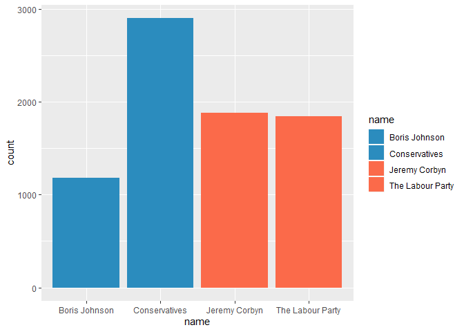
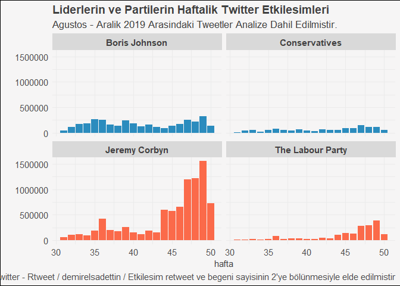
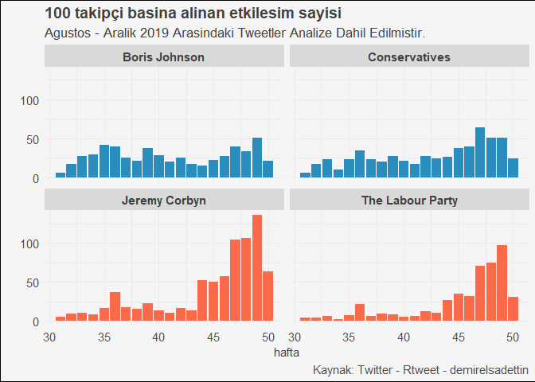
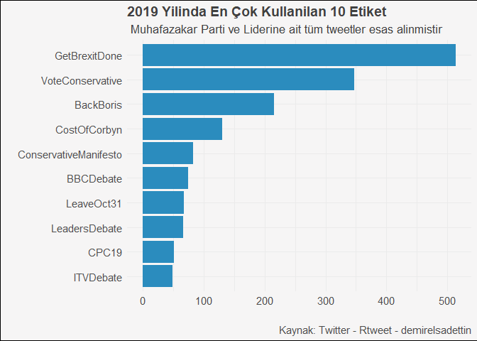
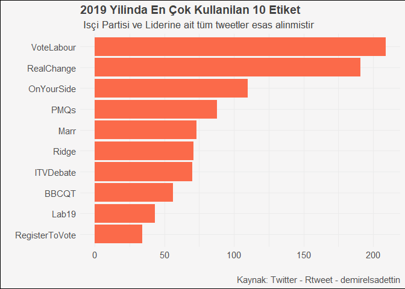

İngiltere Seçimlerinde İşçi Partisi & Muhafazakar Parti ve Liderlerin
Twitter Kullanımı
================

#### **Kullanılacak Paketler**

``` r
library("rtweet")
library("tidyverse")
library("tidytext")
library("lubridate")
library("wordcloud2")
library("rmarkdown")

options(scipen=999)
```

Tema ve font

``` r
extrafont::loadfonts(device = "win")
windowsFonts("Proxima Nova" = windowsFont("Proxima Nova"))

renk <- c("Boris Johnson" ="#2b8cbe",
          "Jeremy Corbyn"="#fb6a4a",
          "The Labour Party"="#fb6a4a",
          "Conservatives" ="#2b8cbe")

theme_custom2 <- function() {
  theme_minimal() +
    theme(
      text = element_text(family = "Proxima Nova", color = "gray25"),
      plot.title = element_text(face = "bold",size = 14),
      plot.subtitle = element_text(size = 13),
      axis.text.x= element_text(size=11),
      axis.text.y = element_text(size=11),
      plot.caption = element_text(size = 11, color = "gray30"),
      plot.background = element_rect(fill = "#f6f5f5"),
      legend.position = "none",
      strip.background = element_rect(colour = "#d9d9d9", fill = "#d9d9d9"),
      strip.text.x = element_text(size = 11, colour = "gray25", face = "bold"))
}
```

Veri setini içeri
aktaralım

``` r
uk_election_tweets <- readRDS("C:/Users/Sadettin/Rstats/uk_election/uk_election_tweets.rds")
head(uk_election_tweets)
```

    ## # A tibble: 6 x 90
    ##   user_id status_id created_at          screen_name text  source
    ##   <chr>   <chr>     <dttm>              <chr>       <chr> <chr> 
    ## 1 117777… 12050504… 2019-12-12 09:03:00 jeremycorb… "And… Twitt…
    ## 2 117777… 12050476… 2019-12-12 08:52:04 jeremycorb… Labo… Twitt…
    ## 3 117777… 12050461… 2019-12-12 08:46:00 jeremycorb… "Tod… Tweet…
    ## 4 117777… 12050435… 2019-12-12 08:35:37 jeremycorb… "Get… Twitt…
    ## 5 117777… 12050423… 2019-12-12 08:31:00 jeremycorb… Labo… Tweet…
    ## 6 117777… 12050383… 2019-12-12 08:15:00 jeremycorb… Trul… Twitt…
    ## # … with 84 more variables: display_text_width <dbl>, reply_to_status_id <chr>,
    ## #   reply_to_user_id <chr>, reply_to_screen_name <chr>, is_quote <lgl>,
    ## #   is_retweet <lgl>, favorite_count <int>, retweet_count <int>,
    ## #   quote_count <int>, reply_count <int>, hashtags <list>, symbols <list>,
    ## #   urls_url <list>, urls_t.co <list>, urls_expanded_url <list>,
    ## #   media_url <list>, media_t.co <list>, media_expanded_url <list>,
    ## #   media_type <list>, ext_media_url <list>, ext_media_t.co <list>,
    ## #   ext_media_expanded_url <list>, ext_media_type <chr>,
    ## #   mentions_user_id <list>, mentions_screen_name <list>, lang <chr>,
    ## #   quoted_status_id <chr>, quoted_text <chr>, quoted_created_at <dttm>,
    ## #   quoted_source <chr>, quoted_favorite_count <int>,
    ## #   quoted_retweet_count <int>, quoted_user_id <chr>, quoted_screen_name <chr>,
    ## #   quoted_name <chr>, quoted_followers_count <int>,
    ## #   quoted_friends_count <int>, quoted_statuses_count <int>,
    ## #   quoted_location <chr>, quoted_description <chr>, quoted_verified <lgl>,
    ## #   retweet_status_id <chr>, retweet_text <chr>, retweet_created_at <dttm>,
    ## #   retweet_source <chr>, retweet_favorite_count <int>,
    ## #   retweet_retweet_count <int>, retweet_user_id <chr>,
    ## #   retweet_screen_name <chr>, retweet_name <chr>,
    ## #   retweet_followers_count <int>, retweet_friends_count <int>,
    ## #   retweet_statuses_count <int>, retweet_location <chr>,
    ## #   retweet_description <chr>, retweet_verified <lgl>, place_url <chr>,
    ## #   place_name <chr>, place_full_name <chr>, place_type <chr>, country <chr>,
    ## #   country_code <chr>, geo_coords <list>, coords_coords <list>,
    ## #   bbox_coords <list>, status_url <chr>, name <chr>, location <chr>,
    ## #   description <chr>, url <chr>, protected <lgl>, followers_count <int>,
    ## #   friends_count <int>, listed_count <int>, statuses_count <int>,
    ## #   favourites_count <int>, account_created_at <dttm>, verified <lgl>,
    ## #   profile_url <chr>, profile_expanded_url <chr>, account_lang <lgl>,
    ## #   profile_banner_url <chr>, profile_background_url <chr>,
    ## #   profile_image_url <chr>

Veriye göz
    atalım

``` r
names(uk_election_tweets) %>% head()
```

    ## [1] "user_id"     "status_id"   "created_at"  "screen_name" "text"       
    ## [6] "source"

#### **Veri Düzenleme & Derleme**

İşimize yarayacak değişkenleri seçtik ve tarih verisini düzenledik.
Seçim günü atılan tweetleri hariç tuttuk.

``` r
ukelection_tidy <- uk_election_tweets %>% 
  select(73,2,3,4,5:7,12:14,17,26,31,49,50,55,78) %>% 
  mutate(date = date(created_at), ay = month(created_at), year = year(created_at), hafta = week(created_at)) %>% 
  filter(date < "2019/12/12")

glimpse(ukelection_tidy)
```

    ## Observations: 12,597
    ## Variables: 21
    ## $ name                 <chr> "Jeremy Corbyn", "Jeremy Corbyn", "Jeremy Corbyn…
    ## $ status_id            <chr> "1204910801372491779", "1204907592218284035", "1…
    ## $ created_at           <dttm> 2019-12-11 23:48:15, 2019-12-11 23:35:30, 2019-…
    ## $ screen_name          <chr> "jeremycorbyn", "jeremycorbyn", "jeremycorbyn", …
    ## $ text                 <chr> "Amazing. Your vote tomorrow will affect our fut…
    ## $ source               <chr> "Twitter Web App", "Twitter Web App", "Twitter M…
    ## $ display_text_width   <dbl> 140, 54, 49, 51, 92, 113, 114, 263, 65, 29, 139,…
    ## $ is_retweet           <lgl> TRUE, TRUE, FALSE, TRUE, FALSE, TRUE, FALSE, FAL…
    ## $ favorite_count       <int> 0, 0, 14640, 0, 6912, 0, 64101, 7305, 22861, 126…
    ## $ retweet_count        <int> 1955, 10415, 5135, 2312, 2234, 1632, 13825, 2552…
    ## $ hashtags             <list> ["CleanBanditChristmasWish", NA, NA, NA, NA, NA…
    ## $ ext_media_url        <list> [NA, <"http://pbs.twimg.com/media/ELitH1_XUAELU…
    ## $ mentions_screen_name <list> ["LittleMix", "LittleMix", NA, "emelisande", NA…
    ## $ retweet_text         <chr> "Amazing. Your vote tomorrow will affect our fut…
    ## $ retweet_created_at   <dttm> 2019-12-11 18:59:22, 2019-12-11 23:18:16, NA, 2…
    ## $ retweet_screen_name  <chr> "LittleMix", "LittleMix", NA, "emelisande", NA, …
    ## $ followers_count      <int> 2294090, 2294090, 2294090, 2294090, 2294090, 229…
    ## $ date                 <date> 2019-12-11, 2019-12-11, 2019-12-11, 2019-12-11,…
    ## $ ay                   <dbl> 12, 12, 12, 12, 12, 12, 12, 12, 12, 12, 12, 12, …
    ## $ year                 <dbl> 2019, 2019, 2019, 2019, 2019, 2019, 2019, 2019, …
    ## $ hafta                <dbl> 50, 50, 50, 50, 50, 50, 50, 50, 50, 50, 50, 50, …

#### **Analiz ve Görselleştirme**

Bir çok analiz yapabiliriz. İlk olarak parti ve adayların attıkları
tweetlere ve etkileşimlere
bakalım

##### **2019 yılında atılan tweet sayısı**

``` r
ukelection_tidy  %>% filter (year == "2019", ay>6) %>%  ggplot(aes(name,fill = name))+geom_histogram(stat = "count", position = "dodge")+scale_fill_manual(values = renk)
```

    ## Warning: Ignoring unknown parameters: binwidth, bins, pad

<!-- -->

##### **Etkileşim**

Begeni ve retweet sayılarının dağılımı. Aşağıdaki işlemde begeni ve
retweet sayısı toplanarak ortalaması alında ve yeni değişkene etkileşim
olarak
adlandırıldı.

``` r
ukelection_tidy  %>% filter (year == "2019", ay > 7 ) %>% mutate(etkilesim = (favorite_count+retweet_count)/2) %>%  ggplot(aes(hafta,etkilesim, fill = name))+geom_col()+facet_wrap(~name)+scale_fill_manual(values = renk)+theme_custom2()+
  labs(x="hafta",y="",
       title = "Liderlerin ve Partilerin Haftalık Twitter Etkileşimleri",
       subtitle = "Ağustos - Aralık 2019 Arasındaki Tweetler Analize Dahil Edilmiştir.",
       caption = "Kaynak: Twitter - Rtweet / demirelsadettin / Etkileşim retweet ve begeni sayısının 2'ye bölünmesiyle elde edilmiştir")+theme_custom2()
```

<!-- -->

``` r
ukelection_tidy  %>% filter (year == "2019", ay> 7) %>% 
  mutate(etkilesim = (favorite_count+retweet_count)/followers_count*100) %>% ggplot(aes(hafta,etkilesim, fill = name))+geom_col()+facet_wrap(~name)+scale_fill_manual(values = renk)+theme_custom2()+labs(x="hafta",y="",
       title = "100 takipçi başına alınan etkileşim sayısı",
       subtitle = "Ağustos - Aralık 2019 Arasındaki Tweetler Analize Dahil Edilmiştir.",
       caption = "Kaynak: Twitter - Rtweet - demirelsadettin")+theme_custom2()
```

<!-- -->

##### **Adaylar ve partiler kullandığı etiketler**

  - Corbyn’in kullandığu
etiketler

<!-- end list -->

``` r
corbyn_etiketler <- ukelection_tidy %>% filter(name == "Jeremy Corbyn", year == "2019") %>% select(hashtags)

corbyn_etiketler2 <-  data.frame(matrix(unlist(corbyn_etiketler$hashtags), nrow = 3091, byrow = TRUE),stringsAsFactors = FALSE)

colnames(corbyn_etiketler2) <- c("etiket")
```

``` r
corbyn_etiketler3 <-  corbyn_etiketler2 %>% count(etiket, sort = TRUE) %>% na.omit() 

corbyn_etiketler3 %>% head()
```

    ## # A tibble: 6 x 2
    ##   etiket         n
    ##   <chr>      <int>
    ## 1 RealChange    52
    ## 2 Marr          51
    ## 3 Ridge         48
    ## 4 PMQs          41
    ## 5 VoteLabour    35
    ## 6 Lab19         22

  - Johnson’ın kullandığı
etiketler

<!-- end list -->

``` r
johnson_etiketler <- ukelection_tidy %>% filter(name == "Boris Johnson", year == "2019") %>% select(hashtags)

johnson_etiketler2 <-  data.frame(matrix(unlist(johnson_etiketler$hashtags), nrow = 1544, byrow = TRUE),stringsAsFactors = FALSE)

colnames(johnson_etiketler2) <- c("etiket")
```

``` r
johnson_etiketler3 <- johnson_etiketler2 %>% count(etiket, sort = TRUE) %>% na.omit() 

johnson_etiketler3 %>% head()
```

    ## # A tibble: 6 x 2
    ##   etiket               n
    ##   <chr>            <int>
    ## 1 GetBrexitDone      136
    ## 2 LeaveOct31          41
    ## 3 BackBoris           32
    ## 4 VoteConservative    31
    ## 5 TeamUK              22
    ## 6 OurNHS              18

  - Labour - İşçi partisinin kullandığı
etiketler

<!-- end list -->

``` r
labour_etiketler <- ukelection_tidy %>% filter(name == "The Labour Party", year == "2019") %>% select(hashtags)

labour_etiketler2 <-  data.frame(matrix(unlist(labour_etiketler$hashtags), nrow = 3103, byrow = TRUE),stringsAsFactors = FALSE)

colnames(labour_etiketler2) <- c("etiket")
```

``` r
labour_etiketler3 <-labour_etiketler2  %>% count(etiket, sort = TRUE) %>% na.omit() 

labour_etiketler3%>% head()
```

    ## # A tibble: 6 x 2
    ##   etiket         n
    ##   <chr>      <int>
    ## 1 VoteLabour   174
    ## 2 RealChange   139
    ## 3 OnYourSide   101
    ## 4 ITVDebate     58
    ## 5 PMQs          47
    ## 6 BBCQT         39

  - Conservative - Muhafazakar partinin kullandığı
etiketler

<!-- end list -->

``` r
conservatives_etiketler <- ukelection_tidy %>% filter(name == "Conservatives", year == "2019") %>% select(hashtags)

conservatives_etiketler2 <-  data.frame(matrix(unlist(conservatives_etiketler$hashtags), nrow = 3678, byrow = TRUE),stringsAsFactors = FALSE)

colnames(conservatives_etiketler2) <- c("etiket")
```

``` r
conservatives_etiketler3 <- conservatives_etiketler2 %>%  count(etiket, sort = TRUE) %>% na.omit()

conservatives_etiketler3 %>%  head()
```

    ## # A tibble: 6 x 2
    ##   etiket                    n
    ##   <chr>                 <int>
    ## 1 GetBrexitDone           378
    ## 2 VoteConservative        316
    ## 3 BackBoris               183
    ## 4 CostOfCorbyn            131
    ## 5 ConservativeManifesto    67
    ## 6 BBCDebate                60

parti ve adayların kullandığı etiketleri birleştirip en çok kullanılan
10 etikete
bakalım.

``` r
cons_john <- bind_rows(johnson_etiketler3, conservatives_etiketler3) %>% group_by(etiket) %>% summarize(toplam = sum(n)) %>% arrange(desc(toplam)) %>% mutate( parti = "muhafazakar - johnson") %>% filter(toplam>=49)

ggplot(cons_john ,aes(fct_reorder(etiket, toplam),toplam))+
  geom_col(fill = "#2b8cbe")+
  coord_flip()+
  theme_custom2()+labs(x="",y="",
       title = "2019 Yılında En Çok Kullanılan 10 Etiket",
       subtitle = " Muhafazakar Parti ve Liderine ait tüm tweetler esas alınmıştır",
       caption = "Kaynak: Twitter - Rtweet - demirelsadettin")+theme_custom2()
```

<!-- -->

``` r
labour_corbyn <- bind_rows(corbyn_etiketler3 , labour_etiketler3) %>% group_by(etiket) %>% summarize(toplam = sum(n)) %>% arrange(desc(toplam))  %>%  mutate(parti = "işçi partisi - corbyn") %>% filter(toplam>=34) 
  
ggplot(labour_corbyn,aes(fct_reorder(etiket, toplam),toplam))+
  geom_col(fill = "#fb6a4a")+
  coord_flip()+
  theme_custom2()+labs(x="",y="",
       title = "2019 Yılında En Çok Kullanılan 10 Etiket",
       subtitle = " İşçi Partisi ve Liderine ait tüm tweetler esas alınmıştır",
       caption = "Kaynak: Twitter - Rtweet - demirelsadettin")+theme_custom2()
```

<!-- -->

##### **En çok kimi retweetlemişler**

Retweet\_screen\_name değişkeni ile 4 hesabın kimi retweetlediğini
bulmak çok kolay. Görselleştirmeyi Flourish ile yaptım. Buradan
ulaşabilirsiniz:

  - [Ag Grafiği](https://public.flourish.studio/visualisation/1087927/)
  - [Sankey
    Grafiği](https://public.flourish.studio/visualisation/1088144/)

<!-- end list -->

``` r
ukelection_tidy %>% group_by(screen_name, retweet_screen_name) %>% count(retweet_screen_name, sort = TRUE) %>% na.omit()  %>% head()
```

    ## # A tibble: 6 x 3
    ## # Groups:   screen_name, retweet_screen_name [6]
    ##   screen_name   retweet_screen_name     n
    ##   <chr>         <chr>               <int>
    ## 1 UKLabour      jeremycorbyn          499
    ## 2 Conservatives BorisJohnson          454
    ## 3 BorisJohnson  Conservatives         208
    ## 4 Conservatives CCHQPress             125
    ## 5 jeremycorbyn  UKLabour              122
    ## 6 jeremycorbyn  JonAshworth            98

Son olarak eldeki veri ile tweet metinlerinde en çok kullanılan ifadeler
ve duygu analizi de yapılabilir. Hali hazırda etiket verisi elimizde
olduğu için gerek duymadım.
